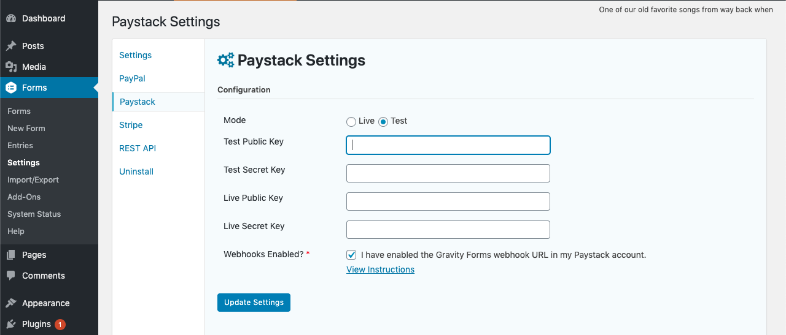

# Paystack Addon for Gravity Forms

## Introduction
Paystack Addon for Gravity Forms allows you to quickly and easily implement credit card payments with WordPress. With the Paystack Add-On you can capture one time credit card payments or setup recurring payment subscriptions.

## Pre-Requisites
- Gravity Forms v2.4+
- WordPress v5.1+
- SSL Certificate Installed and - Configured
- Download and install the add-on
- A Paystack account

## Paystack Settings
The Paystack Settings will allow you to connect and authenticate with your paystack account and it will allow you to setup webhooks which are used to communicate events from Paystack back to your Gravity Forms environment.

Navigate to your Paystack Add-On Settings page:

1. Log into your WordPress admin dashboard.
2. On the left side navigation menu, hover over Forms and click on Settings.
3. Click the Paystack tab.

### Mode
Allows you to specify the default environment you want to send your form submission to. Choosing Live will initiate real transactions, while Test will run the form entry into your paystack test environment, which should not generate any real transactions.